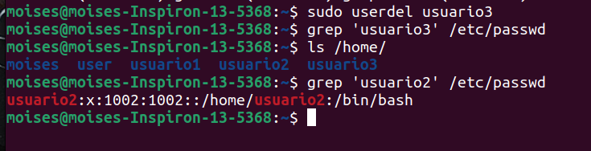

Universidad de San Carlos de Guatemala 
Facultad de Ingeniería
Escuela de Ciencias y Sistemas
Sistemas Operativos 1

&nbsp;&nbsp;&nbsp;&nbsp;&nbsp;&nbsp;&nbsp;&nbsp;&nbsp;&nbsp;&nbsp; Moises David Maldonado de León - 202010833
&nbsp;&nbsp;&nbsp;&nbsp;&nbsp;&nbsp;&nbsp;&nbsp;&nbsp;&nbsp;&nbsp;&nbsp;&nbsp;&nbsp;&nbsp;&nbsp;&nbsp;&nbsp;&nbsp;&nbsp;&nbsp;&nbsp;&nbsp;&nbsp;&nbsp;&nbsp;&nbsp;&nbsp;&nbsp;&nbsp;&nbsp;&nbsp;&nbsp;&nbsp;&nbsp;&nbsp;&nbsp;&nbsp;&nbsp;&nbsp;&nbsp;&nbsp;&nbsp;&nbsp;&nbsp;&nbsp;&nbsp;&nbsp;&nbsp;Tarea 3
-

## Parte 1: Gestión de usuarios
**1. Creación de usuarios**
Crea tres usuarios llamados `usuario1`, `usuario2` y `usuario3`. Comando utilizado:

> **Crear el usuario, su directorio home y asignar el shell**

						`sudo useradd -m -s /bin/bash <USER>'

   **Resultado:**
   
   

**2. Asignación de contraseñas**
Establece una nueva contraseñas para cada usuario creado. Comando utilizado:
> **Al ejecutar se solicita la contraseña y su confirmación (No menor a 8 caracteres)**

						`sudo passwd <USER>'

   **Resultado:**
  
 
**3. Información de usuarios**
 Muestra la información de `usuario1` usando el comando `id`.  Comando utilizado:

						`id <USER>'
   **Resultado:**
  

**4. Eliminación de usuarios**
Elimina `usuario3`, pero conserva su directorio principal. Comando utilizado:

						`sudo userdel <USER>'
> **Después de eliminar se verifica su directorio**
grep 'usuario3' /etc/passwd  ----> Si no muestra nada se eliminó correctamente
ls /home/			

   **Resultado:**
   

## Parte 2: Gestión de grupos

**1. Creación de grupos**
Crea dos grupos llamados `grupo1` y `grupo2`. Comando utilizado:

						`sudo groupadd <GROUP>'
> **Después verifica la creación de grupos**
grep 'grupo1\|grupo2' /etc/group

   **Resultado:**
  

**2. Agregar usuarios a grupos**
Agrega `usuario1` a `grupo1` y `usuario2` a `grupo2`. Comando utilizado:

						`sudo usermod -aG <GROUP> <USER>'
> **-a :  Añade el usuario al grupo sin eliminarlo de otros grupos a los que ya pertenezca.
>  -G: Especifica el grupo o los grupos a los que se debe añadir el usuario.**

**3. Verificar membresía**
Verifica que los usuarios han sido agregados a los grupos utilizando el comando `groups`. Comando utilizado:

						`groups <USER>'

   **Resultado:**
  

**4. Eliminar grupo**
Elimina `grupo2`. Comando utilizado:

						`sudo groupdel <GROUP>'
> **Después verifica la eliminación de grupos**
grep 'grupo2' /etc/group ---> Si no hay salida se eliminó correctamente

   **Resultado:**
  

## Parte 3: Gestión de permisos
**1. Creación de archivos y directorios**
-   Como `usuario1`, crea un archivo llamado `archivo1.txt` en su directorio principal y escribe algo en él.
-   Crea un directorio llamado `directorio1` y dentro de ese directorio, un archivo llamado `archivo2.txt`.

Comandos utilizados:
`sudo -u usuario1 bash -c 'echo "Hola.txt" > /home/usuario1/archivo1.txt'`

`sudo -u usuario1 mkdir /home/usuario1/directorio1`
`sudo -u usuario1 touch /home/usuario1/directorio1/archivo2.txt`

**2. Verificar permisos**
Verifica los permisos del archivo y directorio usando el comando `ls -l` y `ls -ld` respectivamente. Comandos utilizados:
`sudo ls -l /home/usuario1/archivo1.txt`
`sudo ls -ld /home/usuario1/directorio1`

-   **`ls -l`**: Lista los archivos en un formato largo, mostrando permisos, número de enlaces, propietario, grupo, tamaño, fecha y nombre del archivo.
-   **`ls -ld`**: Lista los detalles del directorio en un formato largo, mostrando los permisos del directorio mismo en lugar de su contenido.

   **Resultado:**
  
  
> **Desglose de la Salida**

1.  **Permisos: `-rw-rw-r--`**
	Tipo de archivo. `-` significa archivo regular.
	
    Permisos del propietario (usuario1):
    `r`, lectura;`w`, escritura y  `-`, sin permisos de ejecución.
    
    Permisos del grupo (usuario1):
     `r`, lectura;`w`, escritura y  `-`, sin permisos de ejecución.
    
    Permisos para otros (usuarios que no son el propietario ni pertenecen al grupo):
       `r`, lectura;  `-`,sin permisos de escritura y `-`,sin permisos de ejecución.
    
     Número de enlaces al archivo (generalmente `1` para archivos regulares)
    Tamaño del archivo en bytes (15 bytes).

2.  **Permisos: `drwxrwxr-x`**
    El primer carácter indica el tipo de archivo. `d` significa directorio.  
  Permisos del propietario (usuario1):  `r`, lectura;`w`, escritura y  `x`, ejecución.
  Permisos del grupo (usuario1):  `r`, lectura;`w`, escritura y  `x`, ejecución.
  
	  Permisos para otros (usuarios que no son el propietario ni pertenecen al grupo):
   `r`: Lectura (read); `-`: Sin permisos de escritura; `x`: Ejecución

	Número de enlaces al directorio (generalmente `2` para directorios vacíos: uno para el propio directorio y otro para su directorio padre).   
	
    Tamaño del directorio en bytes (4096 bytes).

**3. Modificar Permisos usando `chmod` con Modo Numérico**
Cambia los permisos del `archivo1.txt` para que sólo `usuario1` pueda leer y escribir (permisos `rw-`), el grupo pueda leer (permisos `r--`) y nadie más pueda hacer nada.

Comando utilizado:
> **Desglose de comando**
-   **`6`**: Permisos del propietario (`rw-`)
-   **`4`**: Permisos del grupo (`r--`)
-   **`0`**: Permisos de otros (`---`)

						`chmod 640 /home/usuario1/archivo1.txt'

   **Resultado:**
  

**4. Modificar Permisos usando `chmod` con Modo Simbólico**
 Agrega permiso de ejecución al propietario del `archivo2.txt`. Comando utilizado:
 
			`chmod u+x /home/usuario1/directorio1/archivo2.txt'
> **Desglose de comando: Modo simbólico**
 - Usuarios
	-   **`u`**: Propietario del archivo (usuario)
	-   **`g`**: Grupo del archivo
	-   **`o`**: Otros usuarios (no el propietario ni miembros del grupo)
	-   **`a`**: Todos (propietario, grupo y otros)

 - Acción
	 -   **`+`**: Añadir el permiso
	-   **`-`**: Quitar el permiso
	-   **`=`**: Establecer el permiso, reemplazando los permisos actuales

- Permisos
	-   **`r`**: Permiso de lectura (read)
	-   **`w`**: Permiso de escritura (write)
	-   **`x`**: Permiso de ejecución (execute)

 **Resultado:**
 

**5. Cambiar el Grupo Propietario**
Cambia el grupo propietario de `archivo2.txt` a `grupo1`. Comando utilizado:
 
			`chgrp <nuevo_grupo> <archivo_o_directorio>'
 **Resultado:**
 

**6. Configurar Permisos de Directorio**
Cambia los permisos del `directorio1` para que sólo el propietario pueda entrar (permisos `rwx`), el grupo pueda listar contenidos pero no entrar (permisos `r--`), y otros no puedan hacer nada.
Comando utilizado:
 
			`chmod 740 /home/usuario1/directorio1'
 **Resultado:**
 

**7. Comprobación de Acceso**
Intenta acceder al `archivo1.txt` y `directorio1/archivo2.txt` como `usuario2`. Nota cómo el permiso de directorio afecta el acceso a los archivos dentro de él.
Comando utilizado:
 
	`sudo -u usuario2 cat /home/usuario1/archivo1.txt'
	`sudo -u usuario2 cat /home/usuario1/directorio1/archivo2.txt'
 **Resultado:**
  

**8. Verificación final**
Verifica los permisos y propietario de los archivos y directorio nuevamente con `ls -l` y `ls -ld`. Comandos utilizados:

`			sudo ls -l /home/usuario1/archivo1.txt           	`
`			sudo ls -ld /home/usuario1/directorio1				`

 **Resultado:**
	 
	 
## Reflexión
**¿Por qué es importante gestionar correctamente los usuarios y permisos en un sistema operativo?**
Gestionar correctamente usuarios y permisos es importante para garantizar la **seguridad** del sistema, proteger la **privacidad** de los datos. Una buena gestión permite mantener la **integridad** del sistema evitando cambios no deseados o no autorizados y asegurar un **control** eficiente sobre los accesos.

**¿Qué otros comandos o técnicas conocen para gestionar permisos en Linux?**
-   **`chown`**: Cambia el propietario y grupo de archivos y directorios.
-   **`umask`**: Establece permisos predeterminados para archivos y directorios nuevos creados por el usuario.
-   **`setfacl` y `getfacl`**: Permiten gestionar Listas de Control de Acceso (ACL) para permisos más granulares.