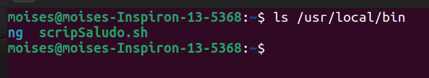
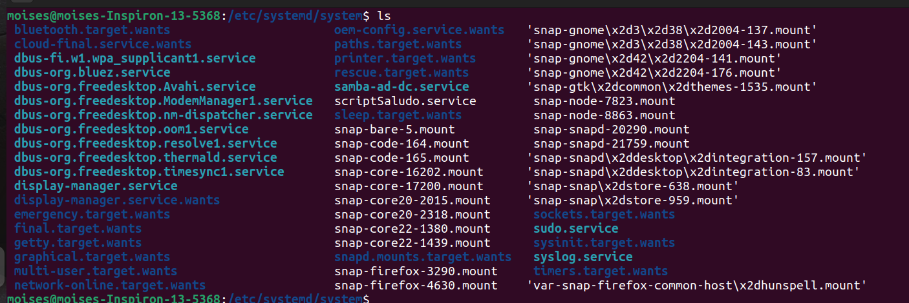
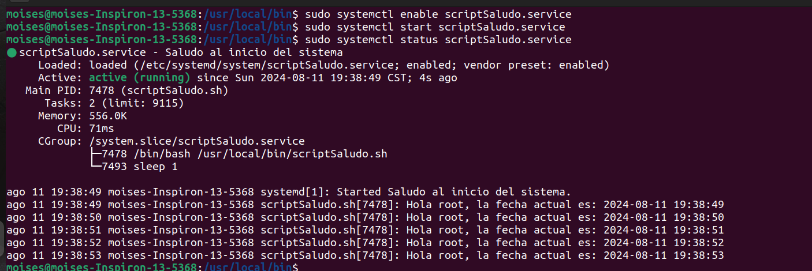

Universidad de San Carlos de Guatemala 

Facultad de Ingeniería

Escuela de Ciencias y Sistemas

Sistemas Operativos 1

# ACTIVIDAD #4

## *Paso 1*
Primero  se debe agregar el script a la siguiente ruta: `/usr/local/bin/`. Esto porque es una ruta estándar para scripts personalizados y es accesible por todos los usuarios. También se le debe agregar permiso de ejecución.

    sudo cp <ruta_script> /usr/local/bin/<nombre_script>
    sudo chmod +x /usr/local/bin/saludo.sh

## *Paso 2*
Crear un archivo con la extensión  `.service`. En el va la siguiente información:

    [Unit] 
    Description=Saludo al iniciar el sistema 
    
    [Service] 
    Type=simple 
    ExecStart=/usr/local/bin/scriptSaludo.sh 
    
    [Install] 
    WantedBy=multi-user.target
> **Unit**: Contiene metadatos y dependencias del servicio. Proporciona una breve descripción del servicio, útil para identificar el propósito del mismo al administrase con `systemctl`.

>  **Service**: Define cómo se ejecuta el servicio. 

 -  Type=simple, indica que es un proceso que se ejecuta en primer plano. Cuando `systemd` inicia el servicio, lo considera activo tan pronto como se lanza el proceso especificado por `ExecStart`.
 
 - **`ExecStart=/usr/local/bin/scriptSaludo.sh`**: Define el comando o script que se ejecutará cuando se inicie el servicio. Aquí se está llamando al script `scriptSaludo.sh` ubicado en `/usr/local/bin/`.

>   **Install**: Especifica cómo y cuándo debe iniciarse el servicio, especialmente durante el arranque del sistema.

-   **`WantedBy=multi-user.target`**: Indica que este servicio debe iniciarse cuando el sistema alcanza el `multi-user.target`. Significa un entorno multiusuario con red (sin entorno gráfico). Es uno de los estados de arranque comunes en un sistema Linux.

## *Paso 3*
Copiar el archivo .service a la siguiente ruta : `/etc/systemd/system/`. Esto porque en esta ruta es el lugar donde los administradores del sistema colocan los archivos de unidades de servicio personalizadas (como `*.service`, `*.socket`, `*.target`, etc.) en un sistema Linux que utiliza `systemd`. 

    sudo cp <ruta_service> /etc/systemd/system/

## *Paso 4*
Habilitar y arrancar el servicio. 

    sudo systemctl enable scriptSaludo.service
    sudo systemctl start scriptSaludo.service

## *Paso 5*
Verificar el estado del servicio y los logs.

    sudo systemctl status saludo.service

## *Deshabilitar/Eliminar servicio*
Si se desea quitar el servicio siga los siguientes pasos:

1. Detener servicio:

	    sudo systemctl stop scriptSaludo.service

2. Deshabilitar para que no inicie con el sistema:

	    sudo systemctl disable scriptSaludo.service

3. Elimina el archivo del servicio:

	   sudo rm /etc/systemd/system/scriptSaludo.service
	    
4. Recargar el daemon de systemd para aplicar los cambios:

	    sudo systemctl daemon-reload
	    
5. Verificar el estado (Indicará que no se encuentra el servicio):

	   systemctl status scriptSaludo.service
	   
6. Eliminar el script de `/usr/local/bin`

	   sudo rm /usr/local/bin/scriptSaludo.sh
