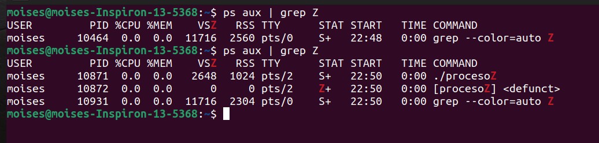
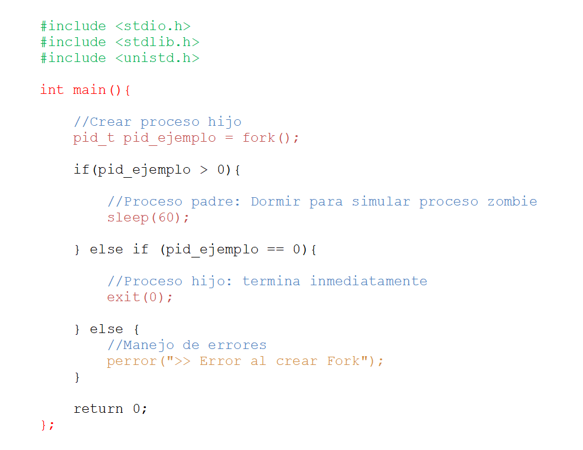
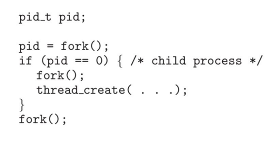
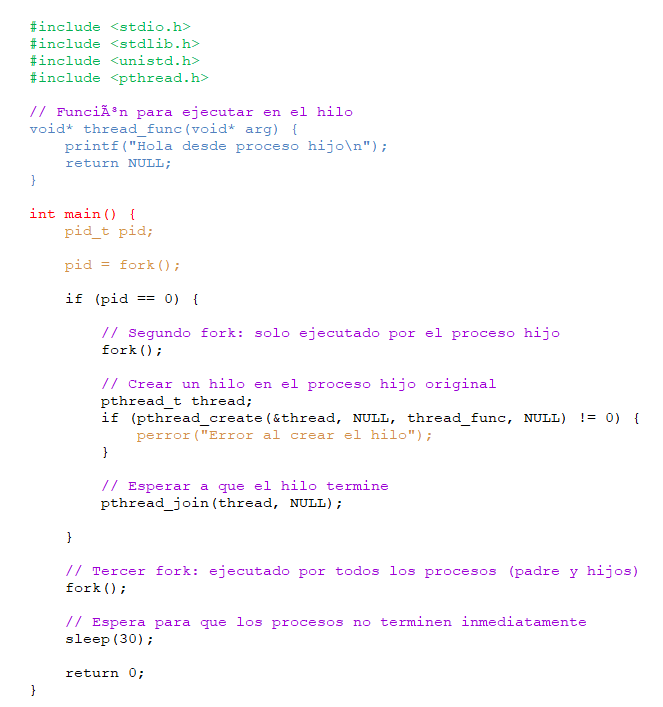

Universidad de San Carlos de Guatemala 

Facultad de Ingeniería

Escuela de Ciencias y Sistemas

Sistemas Operativos 1

# ACTIVIDAD #6: Procesos e Hilos

## 1. ¿Incluyendo el proceso inicial, cuantos procesos son creados por el siguiente programa? Razone su respuesta.

**Respuesta**
1.  **Primera llamada a `fork()`**:

    Después de esta primera llamada, hay 2 procesos ejecutándose: el proceso padre y el proceso hijo.
    
2.  **Segunda llamada a `fork()`**:
    
	   Ambos procesos (el proceso padre y el hijo creados en el paso anterior) llaman a `fork()`. Cada uno de estos procesos crea un nuevo hijo.  Ahora hay un total de 4 procesos: 2 nuevos hijos creados por el segundo `fork()` (uno creado por el proceso padre y otro por el primer hijo).
	   
4.  **Tercera llamada a `fork()`**:
    
    Cada uno de los 4 procesos anteriores genera un nuevo hijo. Ahora hay un total de 8 procesos:

### Conclusión:

El programa genera un total de **8 procesos**: el proceso original más los 7 procesos hijos creados por las tres llamadas a `fork()`. Esto se determina de una manera más sencilla con la siguiente fórmula: `2^n`, donde "n" es el número de llamadas a `fork()`; por tanto se tiene 2^3 = 8. 

## 2. Utilizando un sistema Linux, escriba un programa en C que cree un proceso hijo (fork) que finalmente se convierta en un proceso zombie. Este proceso zombie debe permanecer en el sistema durante al menos 60 segundos.

Se tiene el siguiente código en C:

> **Para compilar y ejecutar:**
> `gcc proceso.c -o procesoZ`
> `./procesoZ`

### Explicación del código

Este código en C crea un proceso hijo usando la función `fork()`. El proceso hijo se convierte en un **proceso zombie** cuando termina su ejecución, mientras que su proceso padre sigue vivo y no ha recogido su estado de salida, es decir, no ha llamado a la función`wait()` para obtener la información de que el hijo ha terminado.

### 1. Función `fork()`

La función `fork()` es fundamental en Unix/Linux para crear procesos. Cuando se llama, genera un **nuevo proceso hijo** que es una copia del proceso padre, pero con un PID (Process ID) diferente.

-   Si `fork()` devuelve un valor mayor que 0, significa que estamos en el proceso **padre**. El valor devuelto es el PID del proceso hijo.
-   Si `fork()` devuelve 0, significa que estamos en el proceso **hijo**.
-   Si `fork()` devuelve un valor negativo, indica un **error** al crear el proceso.

### 2. Proceso hijo (fork = 0)

El código inmediatamente llama a `exit(0);`, lo que hace que el proceso hijo termine rápidamente, convirtiéndose en un **proceso zombie**.

Esto ocurre porque el proceso padre aún no ha recogido el estado del hijo. En este estado, el proceso hijo ha finalizado, pero su entrada en la tabla de procesos del sistema sigue existiendo hasta que el proceso padre llame a `wait()` o termine.

### 3. Proceso padre (fork > 0)

En este caso, el proceso padre ejecuta `sleep(30);`, lo que significa que se detendrá por 30 segundos. Durante este tiempo el proceso hijo termina y entra en estado zombie; no obstante, el proceso padre no está haciendo nada  y, por lo tanto, no recoge el estado del hijo.

Como resultado, el proceso hijo queda en estado zombie durante 60 segundos (el tiempo que el proceso padre está durmiendo), ya que el sistema está esperando que el padre recoja el estado de terminación del hijo.

### 4. Observar proceso zombie

Se puede observar este proceso zombie utilizando comandos como `ps aux | grep Z`: 

### 5. Estado final

Después de que el proceso padre termine su ejecución (después de dormir por 60 segundos), el proceso zombie desaparece. Esto sucede porque el sistema limpia automáticamente los procesos hijos una vez que su proceso padre ha terminado.

## 3. Usando el siguiente código como referencia, completar el programa para que sea ejecutable y responder las siguientes preguntas

• ¿Cuántos procesos únicos son creados?

• ¿Cuántos hilos únicos son creados?

### Código completado:

Se crea una función para ejecutar en el hilo ya que es necesario indicarlo como parámetro de la función `pthread_create()`. Así como una variable de tipo `pthread_t` y se configura para que el programa se ejecute por 30 segundos.

 - ¿Cuántos procesos únicos son creados?
 
	 Dado que tenemos 3 llamadas a `fork()` se puede usar la fórmula anterior:`2^3 = 8`; no obstante se toma en cuenta que en la segunda llamada no crea un proceso para el padre (primera llamada)  y por tanto tampoco creará otro en la tercera llamada. 

	Reduciendo esos 2 procesos el resultado final es de **6 procesos únicos**.
 
	
- ¿Cuántos hilos únicos son creados?
 
	 Solo un hilo es creado por la llamada `thread_create(...)` dentro del primer proceso hijo, por lo que hay **un hilo**.