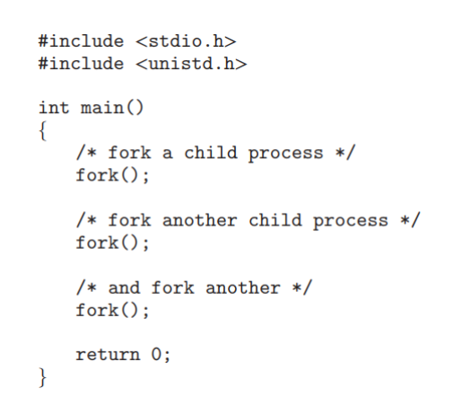

Universidad de San Carlos de Guatemala 

Facultad de Ingeniería

Escuela de Ciencias y Sistemas

Sistemas Operativos 1

# ACTIVIDAD #6: Proceso Zombie

Se tiene el siguiente código en C:

> **Para compilar y ejecutar:**
> `gcc proceso.c -o procesoZ`
> `./procesoZ`

## Explicación del código

Este código en C crea un proceso hijo usando la función `fork()`. El proceso hijo se convierte en un **proceso zombie** cuando termina su ejecución, mientras que su proceso padre sigue vivo y no ha recogido su estado de salida, es decir, no ha llamado a la función`wait()` para obtener la información de que el hijo ha terminado.

### 1. Función `fork()`

La función `fork()` es fundamental en Unix/Linux para crear procesos. Cuando se llama, genera un **nuevo proceso hijo** que es una copia del proceso padre, pero con un PID (Process ID) diferente.

-   Si `fork()` devuelve un valor mayor que 0, significa que estamos en el proceso **padre**. El valor devuelto es el PID del proceso hijo.
-   Si `fork()` devuelve 0, significa que estamos en el proceso **hijo**.
-   Si `fork()` devuelve un valor negativo, indica un **error** al crear el proceso.

### 2. Proceso hijo (fork = 0)

El código inmediatamente llama a `exit(0);`, lo que hace que el proceso hijo termine rápidamente, convirtiéndose en un **proceso zombie**.

Esto ocurre porque el proceso padre aún no ha recogido el estado del hijo. En este estado, el proceso hijo ha finalizado, pero su entrada en la tabla de procesos del sistema sigue existiendo hasta que el proceso padre llame a `wait()` o termine.

### 3. Proceso padre (fork > 0)

En este caso, el proceso padre ejecuta `sleep(30);`, lo que significa que se detendrá por 30 segundos. Durante este tiempo el proceso hijo termina y entra en estado zombie; no obstante, el proceso padre no está haciendo nada  y, por lo tanto, no recoge el estado del hijo.

Como resultado, el proceso hijo queda en estado zombie durante 30 segundos (el tiempo que el proceso padre está durmiendo), ya que el sistema está esperando que el padre recoja el estado de terminación del hijo.

### 4. Observar proceso zombie

Se puede observar este proceso zombie utilizando comandos como `ps aux | grep Z`: 

### 5. Estado final

Después de que el proceso padre termine su ejecución (después de dormir por 30 segundos), el proceso zombie desaparece. Esto sucede porque el sistema limpia automáticamente los procesos hijos una vez que su proceso padre ha terminado.